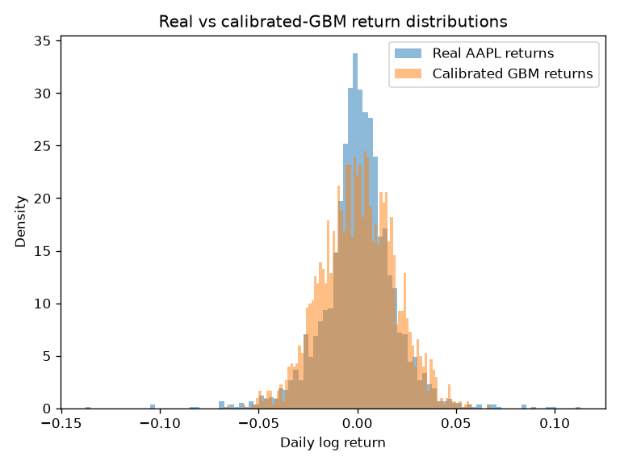
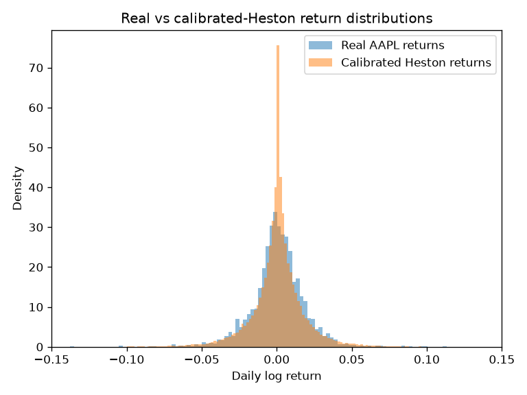

# Calibrating the Models to Real Data

## Aim

Fit the GBM and Heston parameters to real AAPL returns (2015-2024) and honestly
assess how well each model fits.

## Calibrating GBM (maximum likelihood)

Because GBM assumes Gaussian log returns, calibrating it is exactly Gaussian
parameter estimation by maximum likelihood: the volatility is the standard
deviation of the log returns, and the drift is their mean (plus a sigma^2/2
adjustment converting the log-drift to the price drift).

| Parameter | Estimate | Reliability |
|---|---|---|
| Volatility sigma | 29.0% | High — estimated from the spread of ~2,260 returns |
| Drift mu | 27.2% | Low — roughly +/-10%; drift is barely estimable |

The asymmetry is important: volatility is pinned down well, but the drift has a
huge standard error (daily drift ~0.09% is dwarfed by ~1.8% daily noise). This is
a general fact, and a reason option pricing uses the risk-free rate rather than
the un-estimable real drift.

## Goodness of fit — GBM



| Measure | Real AAPL | Calibrated GBM |
|---|---|---|
| Excess kurtosis | 5.40 | 0.03 |

Calibrated GBM matches the *level* of volatility but is essentially Gaussian: it
structurally cannot produce fat tails, no matter how it is calibrated.

## Calibrating Heston (method of moments on realized variance)

Full Heston calibration usually fits the model to market option prices (a
risk-neutral, Q-measure calibration). Here we use a simpler physical-measure (P)
route: method of moments on a 21-day rolling realized-variance series.

| Parameter | Estimate | Read from |
|---|---|---|
| theta (long-run variance) | 0.081 | mean realized variance (matches sigma^2) |
| v0 (current variance) | 0.019 | latest realized variance (calm end-2023) |
| kappa (reversion speed) | 2.56 | lag-1 autocorrelation of realized variance |
| xi (vol of vol) | 0.84 | fluctuation size (CIR moment) |
| rho (leverage) | -0.014 | correlation of returns with volatility changes |

## Goodness of fit — Heston



| Measure | Real AAPL | Calibrated Heston |
|---|---|---|
| Excess kurtosis | 5.40 | 6.69 |
| Skewness | -0.23 | -0.37 |

**Fat tails: reproduced (slightly overshooting).** The calibrated Heston is
clearly leptokurtic — random volatility generates heavy tails that GBM could not,
and here even a little too heavy.

**Negative skew: right sign, wrong reason.** The skew came out negative, but this
is *not* the leverage effect: the calibrated rho is ~0, so the model has almost no
price-variance coupling, and exact Heston with rho = 0 has zero skew. The observed
skew is a **discretization artifact**: the arithmetic Euler scheme means log
returns are ln(1 + shock), and ln is concave, so symmetric shocks produce
left-skewed log returns — amplified by the high vol-of-vol. The violated Feller
condition (2*kappa*theta = 0.41 < xi^2 = 0.70) makes the variance hit zero often,
adding further bias.

The key lesson: an output looking correct is not the same as the mechanism being
captured. The returns-based calibration recovers the parameters returns can reveal
(theta, v0) well, captures tails via xi, but cannot identify rho — so the skew it
shows is numerical, not economic.

## Limitations and next steps

- The rolling realized-variance proxy is smoothed, biasing kappa and xi.
- This is a physical-measure (P) calibration; rho and the volatility skew are far
  better recovered from option prices (Q-measure) with the semi-analytic Heston
  pricer.
- A log-Euler or Milstein scheme respecting the Feller condition would remove the
  spurious skew.

## How to reproduce

```
python calibrate.py
python goodness_of_fit.py
python validate_heston.py
```
