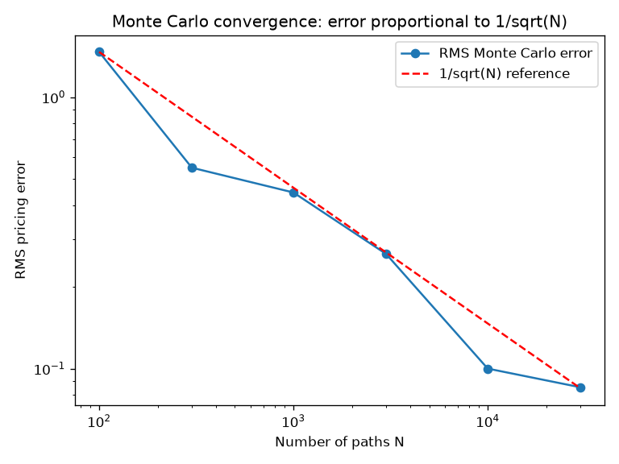

# QuantLab — Final Report

*A quantitative research project: how markets behave, how to model and price that
behaviour, and whether a simple strategy can beat the market.*

## Summary

Real equity returns are not normally distributed — they have fat tails and
volatility clustering. This project documents those facts empirically, builds and
validates an option-pricing engine, develops a stochastic-volatility model that
reproduces the facts from first principles, calibrates it to real data, and finally
evaluates a trend-following trading strategy with dependence-aware, out-of-sample methods. Every
result is checked against a known answer or a defensible argument. The strategy
study reaches a deliberately honest conclusion: no statistically significant edge
over buy-and-hold after costs.

## 1. Motivation and approach

The aim was one coherent, defensible project rather than many disconnected
exercises, following the loop a real quant desk uses: understand the data, model
it, price contracts on it, and test strategies. The guiding discipline throughout
is to **validate everything** — against theoretical values, closed-form
benchmarks, or out-of-sample data. The work is in Python (NumPy, pandas, SciPy,
statsmodels), tested with pytest, and version-controlled on GitHub.

## 2. How markets really behave

Using nine years of Apple daily returns, the textbook normal-distribution
assumption fails in two systematic ways.

**Fat tails.** Excess kurtosis is 5.4 (a normal distribution gives 0), and a
fitted Student-t distribution has just ~3.3 degrees of freedom — very heavy tails.
Extreme days (like the −13.8% COVID crash) happen far more often than a bell curve
allows.


**Volatility clustering.** Turbulent periods cluster in time. Raw returns have
almost no autocorrelation (direction is unpredictable), but *squared* returns are
strongly, persistently autocorrelated — volatility is predictable even though
direction is not.


## 3. Modelling and option pricing

A geometric Brownian motion simulator (integrated with the Euler–Maruyama scheme)
was validated against its exact expected value, then used to price a European call
option by Monte Carlo. The result agreed with the exact Black–Scholes price to
within **0.82%**, and the error was shown to scale as 1/√N, exactly as the Central
Limit Theorem predicts.



Antithetic variates gave a **2.1× variance reduction**, and a path-dependent Asian
option (which has no closed-form price) was priced by simulation — demonstrating
the method where no formula exists.

## 4. A stochastic-volatility model, and its estimation

The Heston model makes volatility itself random and mean-reverting. It reproduces
all three empirical stylised facts (fat tails, volatility clustering, negative
skew) endogenously, from random volatility alone. Estimated from Apple returns, it captures the
fat tails well.


An important honest finding: the estimated model's negative skew turned out to be
a **discretisation artifact** of the simulation scheme, not a captured leverage
effect — because the leverage parameter cannot be reliably estimated from returns
(it is far better recovered from option prices). Recognising that an output can
look right for the wrong reason is central to the project.

## 5. Does a trading strategy work?

A moving-average trend rule on a 20-stock basket was evaluated with look-ahead
control, realistic costs and turnover, explicit holdings-based portfolio accounting,
and dependence-aware inference. (An earlier draft used a daily-rebalanced average
mislabelled as buy-and-hold and an IID bootstrap; both were corrected — see the
revision note in reports/strategy_backtest.md.)

A parameter sweep first illustrated the overfitting trap: one window (20-day) beat
the market as an isolated spike while its neighbours collapsed — the fingerprint of
luck, not signal.


Using a conventional 200-day window fixed a priori and a true buy-and-hold benchmark,
the strategy shows no Sharpe advantage (1.059 vs 1.062), delivers roughly half the
total wealth (4.70x vs 8.68x), and trades about 40x more. A paired moving-block
bootstrap puts the Sharpe difference at -0.003, with a 95% interval covering zero at
every block length. The same null holds under an expanding-window walk-forward that
re-tunes the window each fold as one continuous portfolio (out-of-sample Sharpe difference -0.017, transition costs charged).

**Conclusion:** no statistically significant Sharpe advantage for trend-following
over a true buy-and-hold after costs — a clean, dependence-aware null result. The result is robust to costs, execution lag, rebalancing and the inference method, and holds on a fixed sector-ETF universe that substantially reduces single-stock survivorship bias (though the sign of the tiny, insignificant edge flips there, since survivor buy-and-hold benefits from the winners' compounding).

## 6. Market microstructure: where the money comes from

The rest of the project treats price as one number per day. Real trading happens
one order at a time against a limit order book, so this module drops to that level:
an event-driven order book with price-time priority, and an inventory-aware
market maker following Avellaneda-Stoikov. The maker forms a reservation price
shifted against its inventory — quoting lower when long to encourage selling — and
posts around it, competing with background liquidity for Poisson order flow.

Total profit is decomposed **exactly** into spread capture (edge earned versus the
mid at each fill) and inventory carry (mark-to-market on the position held while
the mid drifts); the two reconcile to total P&L by a summation-by-parts identity,
asserted in the tests. Averaged over 50 seeds with random flow and no latency, the
maker earns +31.3 from spread capture with inventory carry netting to −0.2 — the
skew keeps the position controlled, so profit is almost pure spread.

The exact attribution earns its keep by separating two distinct frictions.
Quoting **latency** (the maker quotes off a stale mid) drains *spread capture* —
total P&L falls ~70% from zero to twenty ticks of delay even though fills rise,
because stale quotes are attractive precisely when mispriced. Introducing informed
(**toxic**) order flow, whose direction matches the next mid move, instead drains
*inventory carry*: at high toxicity, inventory P&L falls to around −13 while spread
capture stays high, because the maker is filled on the wrong side just before the
price moves — genuine adverse selection, and mechanically distinct from the
stale-quote cost. See `reports/microstructure.md`.

## 7. What this project demonstrates

- **Statistical rigour:** letting the data speak, and quantifying uncertainty
  rather than quoting a single Sharpe ratio.
- **Sound modelling:** models built on theory and validated against known answers.
- **Intellectual honesty:** reporting what failed and why — the discretisation
  artifact, the overfitting spike, the insignificant edge.
- **Clean, reproducible code:** a small shared core, independent modules, tests,
  and a public repository.

## 8. Reproducibility

```
python -m venv .venv && pip install -e ".[dev]"
python -m empirical.stylised_facts   # the stylised facts
python price_option.py               # pricing vs Black-Scholes
python calibrate.py                  # model calibration
python run_basket.py                 # the basket strategy study
python run_microstructure.py         # market-making attribution and latency
pytest -q                            # all tests
```

Continuous integration (GitHub Actions) runs linting, type-checking, the full
test suite on Python 3.11 and 3.12, and re-derives the headline numbers offline
from a checksummed data snapshot on every push.

## Detailed stage reports

- Empirical stylised facts: `reports/stylised_facts.md`
- Heston model: `reports/heston.md`
- Calibration: `reports/calibration.md`
- Strategy backtest: `reports/strategy_backtest.md`
- Market microstructure: `reports/microstructure.md`
