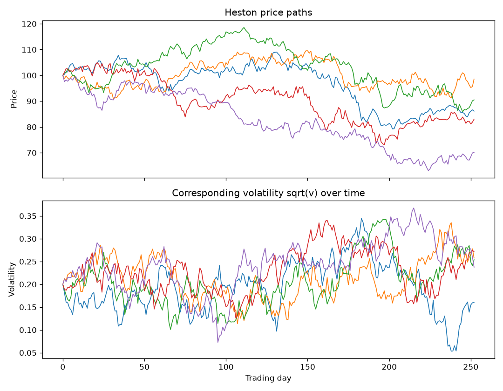
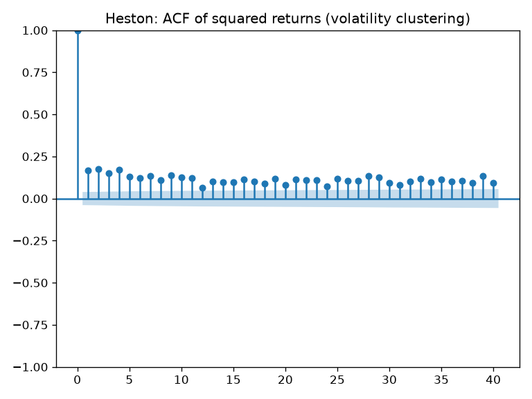
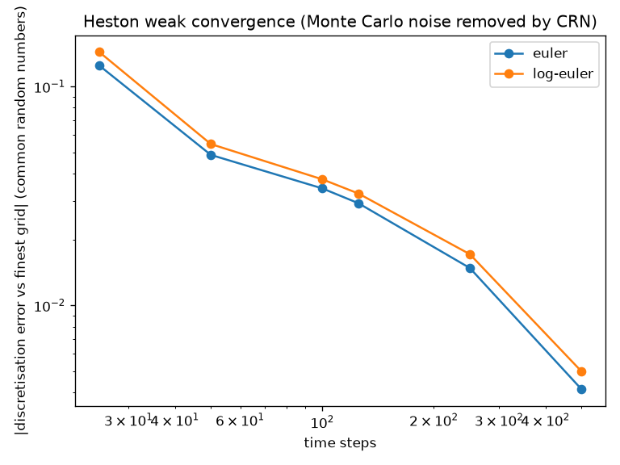

# The Heston Stochastic-Volatility Model

## Motivation

Geometric Brownian motion (GBM) assumes a single, constant volatility. But real
returns have fat tails and volatility clustering (see `stylised_facts.md`). The
Heston model fixes GBM's central flaw by letting the variance itself follow a
random, mean-reverting process.

## The model

Two coupled stochastic differential equations:

```
dS = mu*S dt + sqrt(v)*S dW1
dv = kappa*(theta - v) dt + xi*sqrt(v) dW2,    corr(dW1, dW2) = rho
```

- **v** — the instantaneous variance (volatility squared), now time-varying.
- **kappa, theta** — the speed and long-run level of the variance's mean reversion.
- **xi** — the volatility of volatility, which controls tail fatness.
- **rho** — the correlation between price and variance shocks; negative rho gives
  the leverage effect (volatility rises when prices fall).

Simulated with full truncation (the variance is floored at zero, since variance
cannot be negative). Two update schemes are provided — an arithmetic Euler price
update and a log-price (log-Euler) update; the latter keeps prices positive and
removes an arithmetic-scheme skew artifact, as the convergence study below shows.

## Stochastic volatility in action



The volatility (lower panel) is not constant: it wanders and is pulled back toward
its long-run level. Where volatility is high, the price paths (upper panel) are
more violent, and falling prices coincide with rising volatility — the leverage
effect (rho = -0.7).

## Does it reproduce the empirical stylised facts?

From a 10-year simulated daily path (v0 = theta = 0.04, kappa = 3, xi = 0.5,
rho = -0.7):

| Property | Heston result | GBM / normal |
|---|---|---|
| Excess kurtosis (fat tails) | 2.20 | ~0 |
| Skewness (leverage) | -0.11 | ~0 |
| Squared-return autocorrelation | positive, persistent | ~0 |



Remarkably, the fat tails emerge purely from random volatility, even though every
individual time-step is Gaussian. The model therefore regenerates all three
stylised facts originally found in Apple's returns — the empirics and the model
meet in the middle.

## Numerical scheme and convergence

Two discretisation schemes are provided: an arithmetic Euler update (educational) and
a log-price Euler update (`scheme="log-euler"`). The convergence study is built to
separate **weak (discretisation) error** from **Monte Carlo sampling error**, which an
earlier version conflated:

- The benchmark is the **semi-analytic Heston price** (`pricing/heston_analytic.py`),
  computed from the characteristic function by Gauss-Legendre quadrature. It carries no
  Monte Carlo error. For the study parameters the exact price is **10.1546**; the pricer
  is validated against Black-Scholes in the zero-vol-of-vol limit and by put-call parity.
- Every time-step grid is driven by the **same Brownian path**: increments are generated
  once on the finest grid and summed into the coarser grids (nested common random
  numbers). Each coarse grid's discretisation error is then measured as the *paired*
  difference against the finest grid, whose standard error is small because the shared
  randomness cancels.



Findings: the Feller ratio is 0.640 (violated), so variance truncation is active. With
common random numbers the discretisation error is now **monotone in the step count** and
its confidence interval is far tighter than the ordinary Monte Carlo standard error of
the price — for example the arithmetic scheme's error against the finest grid falls from
about +0.13 at 25 steps to within noise by 500 steps, with a 95% interval an order of
magnitude below the unpaired MC error. (This separation matters: judged by raw price
minus exact benchmark alone, a coarse grid can look *better* than a fine one purely
because opposite-sign discretisation error partly cancels that draw's MC offset — the
paired column removes that illusion.) Both schemes converge to the semi-analytic price.

The schemes differ most in the return distribution. At rho = 0 the true finite-horizon
skew is **small but not exactly zero** — the -1/2 int v dt drift acts on a right-skewed
integrated variance, so uncorrelated shocks still leave mild asymmetry. The point is
that the arithmetic scheme *inflates* it: at one step per day it reports a daily-return
skew near -0.11, which shrinks toward the log-Euler value (about -0.02) and toward zero
as the step is refined (roughly -0.11, -0.07, -0.05, -0.01 at 1x, 2x, 4x, 8x per day).
Most of the arithmetic scheme's skew is therefore a discretisation artifact, not an
economic effect; the log-Euler scheme also guarantees positive prices. A higher-order
scheme (e.g. Andersen quadratic-exponential) would reduce the residual further.

## Next

Calibration: fitting the Heston parameters to real market data.

## How to reproduce

```
python heston_paths.py
python heston_stylised_facts.py
python heston_convergence.py
```
