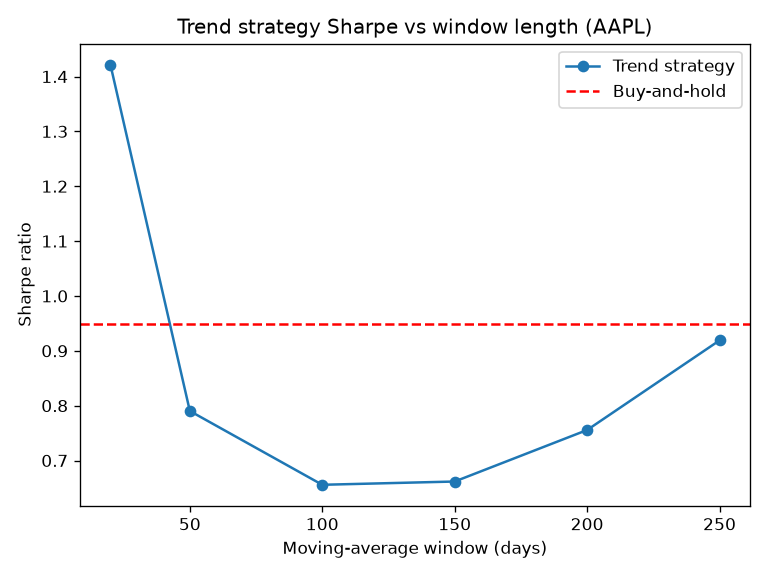

# Trend-Following on AAPL: An Honest Backtest

## Research question

Does a simple moving-average trend-following rule on Apple produce risk-adjusted
returns that beat buy-and-hold, out-of-sample and after transaction costs?

## Method

- **Signal:** long (position 1) when the price is above its N-day moving average,
  flat (0) otherwise.
- **Engine:** positions are lagged one day (no look-ahead bias); a 5 bps
  transaction cost is charged per unit of turnover; the equity curve is the
  cumulative product of daily strategy returns.
- **Benchmark:** buy-and-hold Apple.
- **Metrics:** annualised Sharpe ratio, maximum drawdown, turnover, total return.
- **Data:** AAPL daily returns, 2015-2024.

## The benchmark (buy-and-hold)

| Metric | Value |
|---|---|
| Sharpe | 0.95 |
| Max drawdown | -38.5% |
| Annual turnover | ~0 |
| Total return | +710% |

A high bar — Apple was an excellent stock over the period.

## Single-parameter result (200-day window)

The 200-day rule **underperformed**: Sharpe 0.76 vs 0.95, total return +273% vs
+710%, and only a marginal drawdown improvement (-35.6% vs -38.5%), with high
turnover (5.9x/year). It gave up large upside to sit out dips that were mostly
temporary — trend-following pays off on sustained downtrends, not on a relentless
riser.

## Parameter sensitivity and the overfitting trap



Sweeping the window from 20 to 250 days, only the **20-day window** beat the
benchmark (Sharpe 1.42) — as an isolated spike. Its neighbour (50-day) collapsed
to 0.79. A genuine edge forms a plateau across nearby parameters, not a lone
spike. Reporting the best of six windows would be multiple testing / overfitting.

## Train/test split

Choosing the window on 2015-2019 (train) and evaluating on 2020-2023 (test):

| | Window | Sharpe |
|---|---|---|
| Best on train | 20 | 1.50 |
| Same window on test | 20 | 1.39 |
| Buy-and-hold on test | - | 0.91 |

The in-sample winner **survived out-of-sample** — more encouraging than a pure
in-sample fit.

## Statistical uncertainty (bootstrap, test period)

| Quantity | Sharpe | 95% confidence interval |
|---|---|---|
| Strategy | 1.39 | [0.42, 2.38] |
| Benchmark | 0.91 | [-0.09, 1.91] |
| Difference | 0.48 | [-0.31, 1.33] |

The difference interval **includes zero**: the outperformance is **not
statistically significant**. Four years of data barely constrains a Sharpe ratio.

## Multi-asset basket test

To address the single-stock limitation, the same strategy (200-day window, fixed
a priori) was applied to a basket of 20 large-cap US stocks, forming an
equal-weight portfolio of the trend strategies and of buy-and-hold.

| Quantity | Sharpe | 95% confidence interval |
|---|---|---|
| Trend portfolio | 1.10 | [0.41, 1.81] |
| Buy-and-hold portfolio | 0.99 | [0.32, 1.65] |
| Difference | 0.11 | [-0.31, 0.55] |

Across the basket the edge shrank to a small +0.11 and remained statistically
insignificant. A subtle point: the paired difference interval narrowed (roughly
halved versus the single stock) because diversification cancels idiosyncratic
noise, but the individual Sharpe intervals barely tightened. The precision of a
Sharpe ratio is governed by the length of the track record in time, not the
number of assets.

## Conclusion

Neither on Apple alone nor across a 20-stock basket does a moving-average trend
rule show a statistically significant edge over buy-and-hold after costs. The
single-stock "win" (20-day window, Sharpe 1.42) was an overfitting artifact; with
a conventional window chosen a priori and applied across many names, the edge is a
small +0.11, well within the noise (95% CI [-0.31, 0.55]). This is a deliberately
honest, rigorously-evaluated null result: a real edge is hard to establish, and
detecting one this small would require a much longer history.

## Limitations and next steps

- A single stock, and a test period (COVID, 2022) that happened to favour
  trend-following.
- Sensitive to the 5 bps cost assumption; the 20-day rule has high turnover.
- Establishing a genuine edge would require many assets, a longer history,
  walk-forward validation, and multiple-testing corrections (e.g. deflated Sharpe).

## How to reproduce

```
python backtest_check.py     # engine sanity check + benchmark metrics
python run_strategy.py        # 200-day strategy vs benchmark
python param_sweep.py         # Sharpe vs window (overfitting)
python train_test.py          # out-of-sample evaluation
python uncertainty.py         # bootstrap confidence intervals (single stock)
python portfolio.py           # 20-stock basket
python uncertainty_portfolio.py  # bootstrap the basket difference
```
