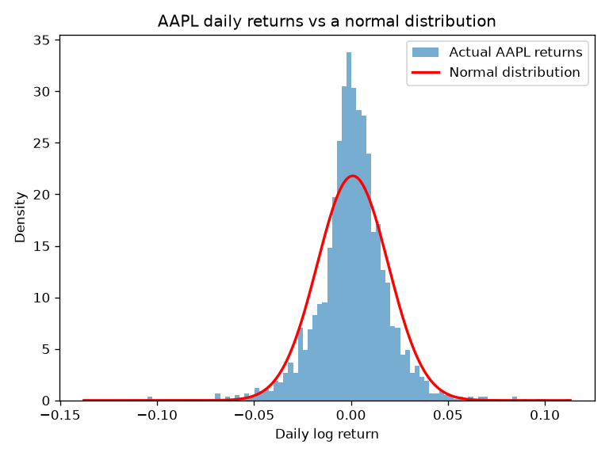
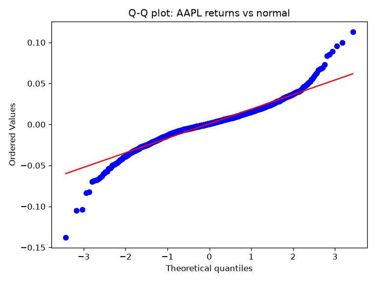
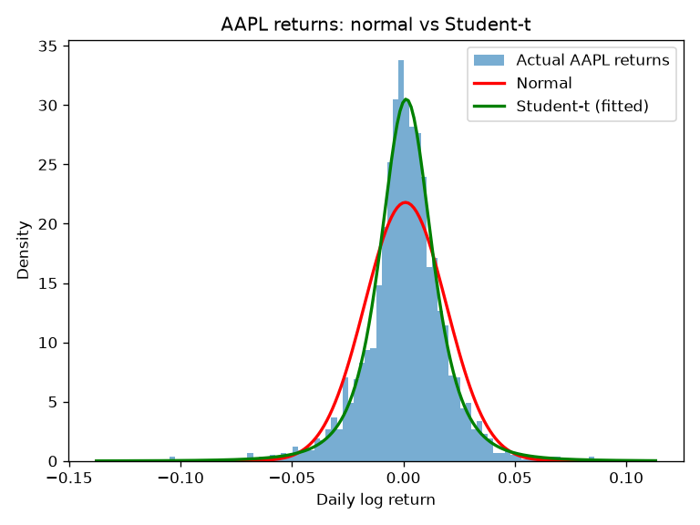
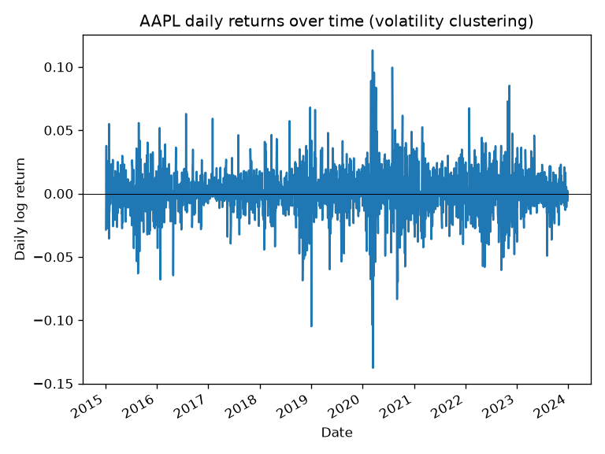
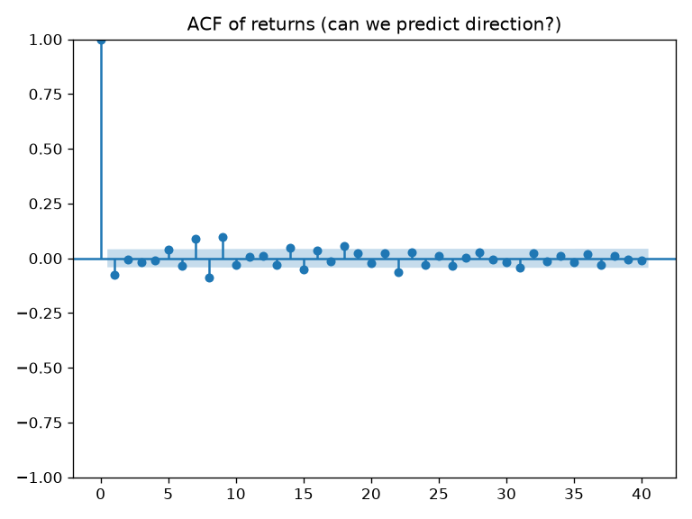
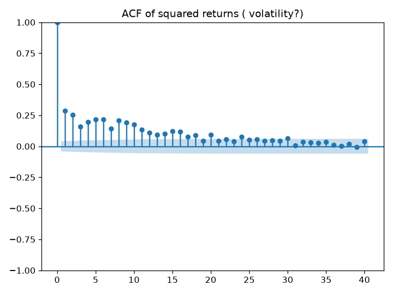

# Week 2 — Stylised Facts of Asset Returns

**Data:** AAPL daily adjusted close, 2015–2024 (2,263 daily log returns).
**Goal:** Test whether real equity returns match the textbook assumption that
returns are normally distributed. They do not — this note documents two
well-known *stylised facts*: fat tails and volatility clustering.

## Summary statistics

| Statistic | Value | Normal-distribution benchmark |
|---|---|---|
| Mean (daily) | 0.00091 | — |
| Std (daily) | 0.0183 | — |
| Skewness | −0.23 | 0 |
| Excess kurtosis | 5.42 | 0 |

The daily standard deviation (1.8%) dwarfs the mean (0.09%), so on any given day
noise overwhelms drift. Skewness is mildly negative (sharper downside moves), and
the excess kurtosis of 5.42 is the first sign of heavy tails.

## Finding 1: Fat tails (leptokurtosis)

Returns have far more extreme moves than a normal distribution allows.



Against a normal curve with the same mean and variance, the empirical
distribution has a **taller, narrower peak**, **thinner shoulders**, and
**fatter tails** — the classic leptokurtic shape.



The Q-Q plot confirms this: points follow the line through the centre but
**peel away at both ends**, meaning the extreme quantiles are more extreme than
normal. The left tail departs more than the right, consistent with the negative
skew.



A **Student-t** distribution fitted by maximum likelihood gives **≈3.3 degrees
of freedom** — very heavy tails (as df → ∞ the t becomes normal). The fitted t
(green) tracks both the peak and the tails far better than the normal (red).
Note: with df < 4 the theoretical kurtosis is infinite, underlining how far the
data sits from Gaussian.

## Finding 2: Volatility clustering

Large moves cluster in time: turbulent periods follow turbulent periods.



The return series is visibly non-uniform — calm stretches (e.g. 2017) alternate
with violent bursts (notably the COVID shock of early 2020). If volatility were
constant, this band would be uniform in width.




The autocorrelation functions make the point rigorously. Raw returns (left) show
**no significant autocorrelation** — direction is essentially unpredictable.
Squared returns (right) show **strong, slowly decaying positive autocorrelation**
— volatility is persistent and predictable. In short: *the sign of returns is
unforecastable, but the size is not.* This asymmetry is the foundation of
volatility models such as GARCH.

## Conclusion

AAPL returns are non-Gaussian: heavy-tailed (Student-t df ≈ 3.3, excess kurtosis
5.4) and exhibiting volatility clustering (persistent autocorrelation in squared
returns). These stylised facts motivate the later modules — non-normal
distributions for tail risk, and stochastic-volatility models (e.g. Heston) to
capture time-varying volatility.

## How to reproduce

```
python -m empirical.stylised_facts
```
